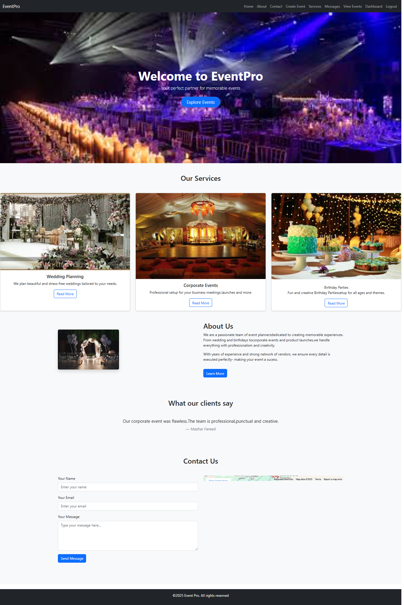
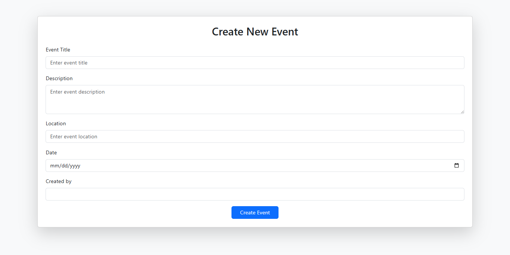

# Event Management System 🎉

A simple and functional Event Management System built using PHP, MySQL, HTML, CSS, and JavaScript. This system allows users to register, log in, create events, and manage them from a dashboard.

## 🌟 Features

- User Registration & Login
- Dashboard for managing events
- Create, Edit, and Delete events
- Contact form with message saving
- View registered users and messages (admin side)
- Responsive frontend using HTML/CSS
- Database connection via `connection.php`

## 💻 Technologies Used

- PHP (Core PHP)
- MySQL (Database)
- HTML5, CSS3
- JavaScript
- Basic File Handling
  
Screenshots
| Homepage | Services | Contact |
|-----------|-----------|----------|
|  |  |  |   |

My Role:
**Full Stack Web Developer**

